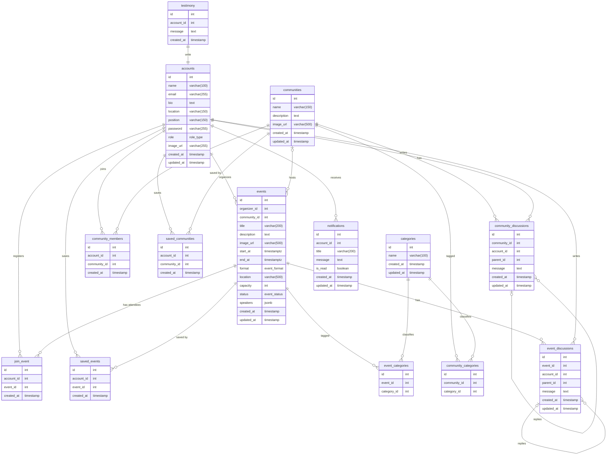

DBDIAGRAM : https://dbdiagram.io/d/6aafe374943b561dd49397db

Eventhub ERD
---

```mermaid
erDiagram
    accounts {
        id int
        name varchar(100)
        email varchar(255)
        bio text
        location varchar(150)
        position varchar(150)
        password varchar(255)
        role role_type
        image_url varchar(255)
        created_at timestamp
        updated_at timestamp
    }

    communities {
        id int
        name varchar(150)
        description text
        image_url varchar(500)
        created_at timestamp
        updated_at timestamp
    }

    categories {
        id int
        name varchar(100)
        created_at timestamp
        updated_at timestamp
    }

    events {
        id int
        organizer_id int
        community_id int
        title varchar(200)
        description text
        image_url varchar(500)
        start_at timestamptz
        end_at timestamptz
        format event_format
        location varchar(500)
        capacity int
        status event_status
        speakers jsonb
        created_at timestamp
        updated_at timestamp
    }

    testimony {
        id int
        account_id int
        message text
        created_at timestamp
    }

    join_event {
        id int
        account_id int
        event_id int
        created_at timestamp
    }

    saved_events {
        id int
        account_id int
        event_id int
        created_at timestamp
    }

    community_members {
        id int
        account_id int
        community_id int
        created_at timestamp
    }

    saved_communities {
        id int
        account_id int
        community_id int
        created_at timestamp
    }

    event_categories {
        id int
        event_id int
        category_id int
    }

    community_categories {
        id int
        community_id int
        category_id int
    }

    event_discussions {
        id int
        event_id int
        account_id int
        parent_id int
        message text
        created_at timestamp
        updated_at timestamp
    }

    community_discussions {
        id int
        community_id int
        account_id int
        parent_id int
        message text
        created_at timestamp
        updated_at timestamp
    }

    notifications {
        id int
        account_id int
        title varchar(200)
        message text
        is_read boolean
        created_at timestamp
        updated_at timestamp
    }

    accounts ||--o{ events : "organizes"
    communities |o--o{ events : "hosts"

    accounts ||--o{ join_event : "registers"
    events ||--o{ join_event : "has attendees"
    accounts ||--o{ saved_events : "saves"
    events ||--o{ saved_events : "saved by"

    accounts ||--o{ community_members : "joins"
    communities ||--o{ community_members : "has members"
    accounts ||--o{ saved_communities : "saves"
    communities ||--o{ saved_communities : "saved by"

    events ||--o{ event_categories : "tagged"
    categories ||--o{ event_categories : "classifies"
    communities ||--o{ community_categories : "tagged"
    categories ||--o{ community_categories : "classifies"

    testimony ||--|| accounts : "write"

    events ||--o{ event_discussions : "has"
    accounts ||--o{ event_discussions : "writes"
    event_discussions |o--o{ event_discussions : "replies"

    communities ||--o{ community_discussions : "has"
    accounts ||--o{ community_discussions : "writes"
    community_discussions |o--o{ community_discussions : "replies"

    accounts ||--o{ notifications : "receives"
```